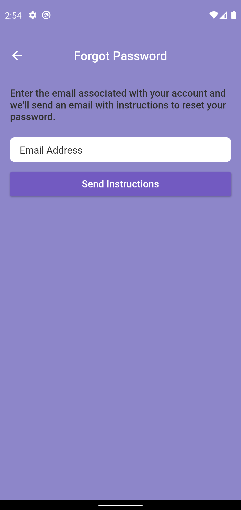

# flutter_login

This is a basic login screen made to show flutter and how easily a design can be turned into a working model. Forgot password brings you to a template for sending reset password instructions, while the log in and sign up text use a custom fade transition that would be nice to see in an app setting.

